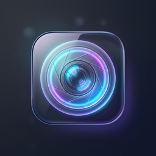

# GlassShot 📸

<div align="center">
  
  <h3>The High-Performance CleanShot X Alternative for Windows</h3>
  <p>Pixel-perfect screenshots, real-time screen recordings, instant OCR, SkiaSharp annotations, and interactive floating thumbnail stacks.</p>
</div>

---

## ✨ Features

- 🎯 **Pixel-Perfect Area & Fullscreen Capture**: Zero-latency virtual-screen multi-monitor capture with magnifier loupe precision.
- 🎥 **Screen Recording & GIF Export**: Real-time high-framerate recording powered by FFmpeg with 2-pass Bayer dithering for crisp, lightweight GIFs.
- 🔍 **Native Windows OCR Engine**: Extract text instantly from any screen selection straight to your clipboard with one shortcut.
- 🗂️ **Interactive Quick Access Floating Stack**: Floating screenshot cards with macOS-inspired deck animations, drag-and-drop support, smooth wheel scrolling, and auto-dismiss timers.
- 🎨 **SkiaSharp Annotation Studio**: Draw arrows, rectangles, blur sensitive information, and apply social gradient backgrounds with drop shadows.
- 🧹 **Auto-Hide Desktop Icons**: Automatically hides cluttered desktop icons during capture for clean, distraction-free screenshots.
- ⚙️ **Dark Glassmorphic Preferences**: Fully customizable keyboard shortcuts, video framerates, encoding presets, and capture directories.

---

## ⌨️ Default Keyboard Shortcuts

| Action | Shortcut | Description |
| :--- | :--- | :--- |
| **Capture Area** | <kbd>Ctrl</kbd> + <kbd>Shift</kbd> + <kbd>C</kbd> | Interactive screen crop with real-time loupe |
| **Capture Fullscreen** | <kbd>Ctrl</kbd> + <kbd>Shift</kbd> + <kbd>F</kbd> | Instantly captures entire virtual desktop |
| **Record Screen** | <kbd>Ctrl</kbd> + <kbd>Shift</kbd> + <kbd>V</kbd> | Crop an area to record video / generate GIFs |
| **Capture Text (OCR)** | <kbd>Ctrl</kbd> + <kbd>Shift</kbd> + <kbd>T</kbd> | Recognizes and copies on-screen text |
| **Toggle Desktop Icons** | <kbd>Ctrl</kbd> + <kbd>Shift</kbd> + <kbd>H</kbd> | Shows/hides all desktop icons |

*(All shortcuts can be customized in the Preferences menu)*

---

## 🚀 Getting Started

### Prerequisites
- [.NET 8.0 SDK](https://dotnet.microsoft.com/download/dotnet/8.0) or higher
- Windows 10 (Build 19041+) / Windows 11

### Build & Run from Source
```powershell
# Clone the repository
git clone https://github.com/Priyanshu10045/GlassShot.git
cd GlassShot

# Run in development mode
dotnet run
```

### Produce a Release Build
```powershell
dotnet publish -c Release -r win-x64 --self-contained false -o ./dist
```

---

## 🛠️ Technology Stack

- **Framework**: C# 12 / WPF (.NET 8)
- **Graphics & Rendering**: SkiaSharp (Hardware accelerated 2D vector graphics)
- **Video & GIF Processing**: FFmpeg CLI Automation
- **System Integration**: Win32 API Interop (GDI+, PerMonitorV2 High-DPI Context, Global Hotkeys via NHotkey)
- **Text Recognition**: Windows.Media.Ocr native runtime

---

## 📄 License

Distributed under the MIT License. See [LICENSE](LICENSE) for details.
